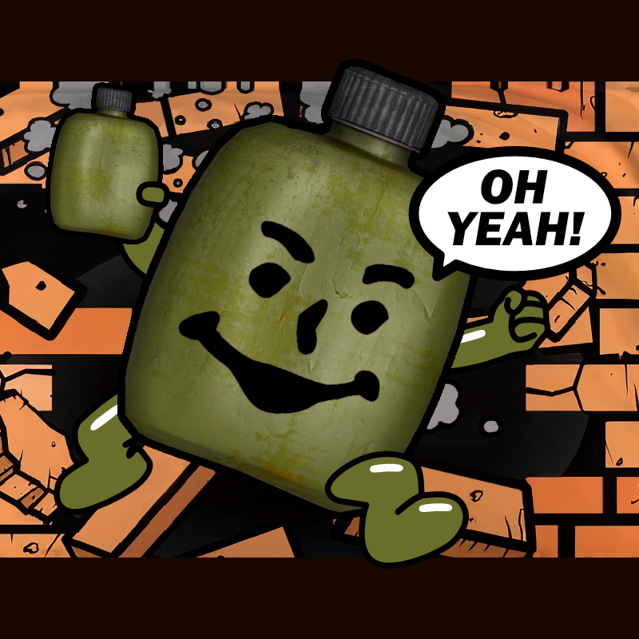

# Fillable Canteens HARDCORE for Anomaly and GAMMA
Adds new mechanics and tweaks the balance of the Fillable Canteens mod for a more difficult, survival-ish experience. This mod was originally created for GAMMA and is tuned with its balance and difficulty in mind.

## What this mod changes from Fillable Canteens:

### 1. Progression
- You can't purify dirty water directly. You first have to boil it to get most of the toxins out, then you can apply the purification tablets to make it 100% safe to drink.
- You boil dirty water through the cooking UI which requires a cooking kit use. (NOTE: you can still choose to use Campfire Roasting instead, in which case the included patch will adjust costs accordingly and disable the cooking UI option).
- Dirty and boiled water give significant radiation, hunger, and sleepiness debuffs. Boiled water is a bit safer to drink than dirty water, and both can be useful in a bind, but neither is ideal.

### 2. Item Scarcity
- Traders no longer sell flasks (unless using "Tourist" economy). You usually get one in your starting loadout but the rest you have to find.
- Traders at most sell 1 bottle of purification tablets per restock (unless using "Tourist" economy).
- Very rare dynamic item spawns. Finding clean water is extremely rare. Finding dirty or boiled water is slightly more common but still rare. Purification tablets can be found but are among the rarest of medical items.

### 3. Crafting/Usage
- Cooking meals with flasks yield empty canteens.
- Adds "empty" and "empty all" context menu items to flasks to recover empty canteens.
- Manually combining flasks via drag and drop yield empty canteens.
- If ZAS (Zatura's Auto-Stacking) is installed, combined flasks yield empty canteens.
- New alternate recipe for cheap vodka (2 Nemiroff, 1 empty canteen).
- New alternate recipe for bandages (2 cheap vodka, 1 fabric).
- Empty canteens can be dissassembled (for 1 scrap metal).

### Sounds
- Tuned OGG comment values for all sounds
- Replaced roasting and boiling sounds
- Added emptying sound

### 3. Balance
- Max uses for flasks are lowered to 5 and thirst reduction is reduced back to ~900 per full canteen.
- Purification tablets now have a base cost of 1112 for 3 uses (or 1978 if you choose Campfire Roasting). At these prices the total cost to boil and purify water is inline with what a flask used to cost.

### 4. UI
- Adds color indicators to dirty/boiled/clean water icons.
- Optional camo-style icon for flasks/canteens (it's not very good but it's an option).
- Recolors purification tablets to be more similar to canteens and less similar to other medication.
- Replaces the map icon for the water pump.

### 5. MCM Options
- Enable/disable camo-style icons
- Enable/disable icon indicators
- Enable/disable recolored purification tablet icon
- Enable/disable restricted trader stock
- Adjust visibility of "roast all", "boil all", and "empty all" menu items

## Installation
> [!IMPORTANT]
> - Requires Modded EXEs 
> - Requires MCM 
> - Mod Organizer 2 is **Highly** Recommended 

1. Install [Fillable Canteens 2.0](https://www.moddb.com/mods/stalker-anomaly/addons/fillable-canteens-20) via Mod Organizer 2
   1. Tick/Untick "Water Pumps" to your preference.
   2. Tick "Campfire Roasting" only if you prefer that over using the cooking UI.

2. Install [Fillable Canteens HARDCORE](https://github.com/bellyillish/gtfc/releases) via Mod Organizer 2
   1. If you ticked "Campfire Roasting" in the previous step, also tick "01 Patch for Campfire Roasting" to enable the correct price/weight settings.
   2. Put this below (higher priority than) Fillable Canteens.

3. Go to Mod Configuration Menu -> Fillable Canteens to customize and configure.

## Notes
  - ModDB:
  - GAMMA Discord: https://discord.com/channels/912320241713958912/1240457027382280222
  - How to install mods with Mod Organizer 2: https://anomalymodding.blogspot.com/2021/04/Mod-Organizer-2-setup-and-Amomaly-modding-guide.html
